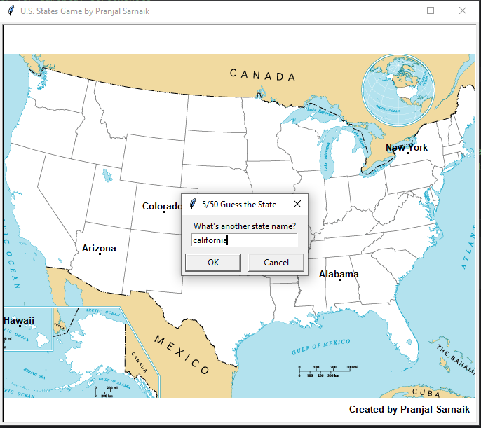

# U.S. States Game
The U.S. States Game is an interactive guessing game where players enter state names. Correct guesses appear on a U.S. map, while incorrect ones do nothing. Players can exit anytime, and unguessed states are saved for review.

## Screenshots


## Author
Pranjal Sarnaik

## Features
- Uses OOP with `StateInfoCalculation` and `WriteState` classes.  
- Reads and processes data from a CSV file.  
- Displays guessed states dynamically on a graphical U.S. map.  
- Saves unguessed states to `RemainingStates/missing_states_to_guess.csv`.  
- Congratulates the player upon completion.  

## Level
Intermediate

## Tech Stack
Python | Pandas | Turtle | CSV Handling | OOP | Data Visualization  

## How to Run
1. Clone the repo:  
   ```bash  
   git clone https://github.com/pranjalco/us-state-game-intermediate.git

3. Run:
    ```bash  
   python app.py

**Created by Pranjal Sarnaik**  
*Released under the MIT License*